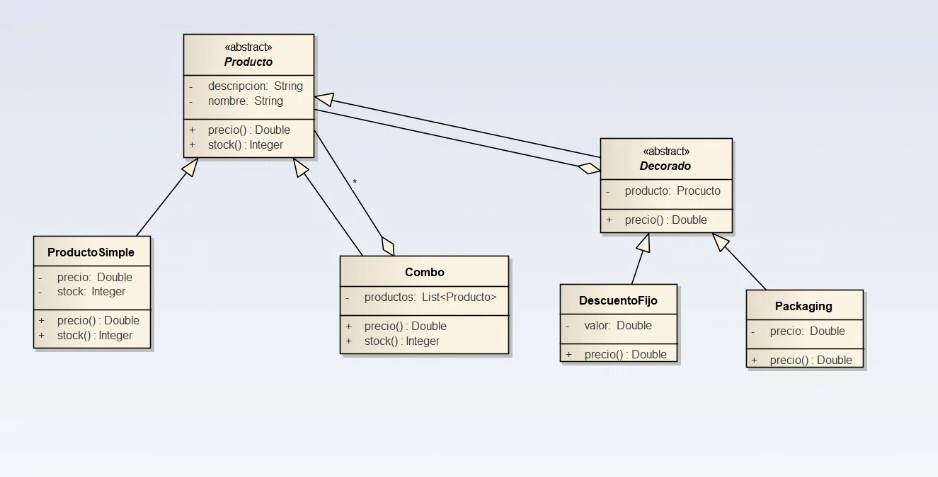

# Módulo de manejo de stock y precios

UTN FRBA - Cátedra de Diseño de Sistemas

## Enunciado

Nos han solicitado el diseño y desarrollo de un módulo que se encargue de calcular el stock de productos de cualquier local comercial, así como también el cálculo de precios de los mismos.  

Se debe tener en cuenta que no solamente existen y se venden productos simples, sino que también existen combos.  

Un combo está formado por productos que se venden juntos. También pueden existir combos de combos.  

Por ejemplo, un local de motos vende motos, cascos, guantes, chalecos, pilotos, entre otros productos; pero también 
vende algunos combos como por ejemplo guantes + casco + chaleco.  

Cada producto tiene un precio en particular. El precio del combo es el resultado de la suma de los productos que 
contiene.  

Además, se debe permitir aplicar descuentos a los distintos productos/combos, los cuales podrían ser acumulables.  

Por último, nos han avisado que los productos/combos podrían ser vendidos con distintos packagings, cada uno de los 
cuales tiene un precio particular que se debería sumar al precio final del producto.

## Diagrama de clases

